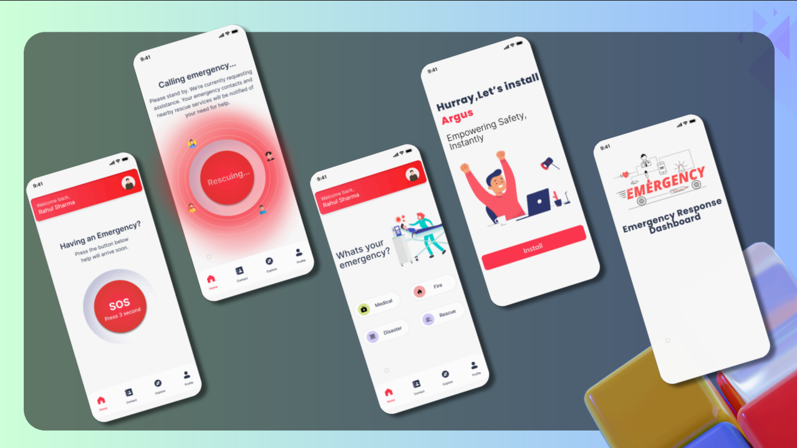

# ARGUS – Disaster Management & Emergency Response System


---

ARGUS is a disaster management platform designed to improve emergency response through real-time incident reporting, volunteer coordination, and intelligent resource management. The platform provides a centralized dashboard for managing disasters while enabling faster communication between affected individuals, volunteers, and response teams.

## 🚀 Features

* 🚨 Real-time SOS and emergency incident reporting
* 👥 Volunteer registration and coordination
* 📍 Disaster incident management dashboard
* 🔐 Secure user authentication and authorization
* 📊 Centralized management of emergency resources
* 🌐 Responsive web interface for desktop and mobile devices
* 🔄 RESTful API architecture for seamless frontend-backend communication
* 🗄️ Persistent data storage using MongoDB

---

## 🛠️ Tech Stack

### Frontend

* HTML5
* CSS3
* JavaScript

### Backend

* Node.js
* Express.js
* Socket.io
* JWT Authentication
* Bycrypt

### Database

* MongoDB

### APIs

* REST APIs

---

---

## 📂 Project Structure

```text
ARGUS/
📂components
 ┃ ┣ 📂footer
 ┃ ┃ ┗ 📜index.html
 ┃ ┗ 📂header
 ┃ ┃ ┗ 📜index.html
 ┣ 📂css
 ┃ ┗ 📜aos.css
 ┣ 📂getStyles
 ┃ ┣ 📜getStyles.css
 ┃ ┗ 📜getStyles.js
 ┣ 📂icons
 ┃ ┣ 📜apple-icon-180.png
 ┃ ┣ 📜apple-splash-1125-2436.jpg
 ┃ ┣ 📜apple-splash-1136-640.jpg
 ┃ ┣ 📜apple-splash-1170-2532.jpg
 ┃ ┣ 📜apple-splash-1179-2556.jpg
 ┃ ┣ 📜apple-splash-1242-2208.jpg
 ┃ ┣ 📜apple-splash-1242-2688.jpg
 ┃ ┣ 📜apple-splash-1284-2778.jpg
 ┃ ┣ 📜apple-splash-1290-2796.jpg
 ┃ ┣ 📜apple-splash-1334-750.jpg
 ┃ ┣ 📜apple-splash-1488-2266.jpg
 ┃ ┣ 📜apple-splash-1536-2048.jpg
 ┃ ┣ 📜apple-splash-1620-2160.jpg
 ┃ ┣ 📜apple-splash-1640-2360.jpg
 ┃ ┣ 📜apple-splash-1668-2224.jpg
 ┃ ┣ 📜apple-splash-1668-2388.jpg
 ┃ ┣ 📜apple-splash-1792-828.jpg
 ┃ ┣ 📜apple-splash-2048-1536.jpg
 ┃ ┣ 📜apple-splash-2048-2732.jpg
 ┃ ┣ 📜apple-splash-2160-1620.jpg
 ┃ ┣ 📜apple-splash-2208-1242.jpg
 ┃ ┣ 📜apple-splash-2224-1668.jpg
 ┃ ┣ 📜apple-splash-2266-1488.jpg
 ┃ ┣ 📜apple-splash-2360-1640.jpg
 ┃ ┣ 📜apple-splash-2388-1668.jpg
 ┃ ┣ 📜apple-splash-2436-1125.jpg
 ┃ ┣ 📜apple-splash-2532-1170.jpg
 ┃ ┣ 📜apple-splash-2556-1179.jpg
 ┃ ┣ 📜apple-splash-2688-1242.jpg
 ┃ ┣ 📜apple-splash-2732-2048.jpg
 ┃ ┣ 📜apple-splash-2778-1284.jpg
 ┃ ┣ 📜apple-splash-2796-1290.jpg
 ┃ ┣ 📜apple-splash-640-1136.jpg
 ┃ ┣ 📜apple-splash-750-1334.jpg
 ┃ ┣ 📜apple-splash-828-1792.jpg
 ┃ ┣ 📜manifest-icon-192.maskable.png
 ┃ ┗ 📜manifest-icon-512.maskable.png
 ┣ 📂img
 ┃ ┣ 📜ambulance.svg
 ┃ ┣ 📜install.svg
 ┃ ┣ 📜login.svg
 ┃ ┣ 📜signup.svg
 ┃ ┣ 📜user.svg
 ┃ ┗ 📜volunteer.svg
 ┣ 📂install
 ┃ ┗ 📜index.html
 ┣ 📂js
 ┃ ┣ 📜aos.js
 ┃ ┣ 📜index.js
 ┃ ┗ 📜sw.js
 ┣ 📂login
 ┃ ┗ 📜index.html
 ┣ 📂logo
 ┃ ┣ 📜loaderImage.svg
 ┃ ┣ 📜logo-alt.png
 ┃ ┣ 📜logo-alt.svg
 ┃ ┣ 📜logo.png
 ┃ ┗ 📜logo.svg
 ┣ 📂service
 ┃ ┣ 📜dashboard.js
 ┃ ┗ 📜index.html
 ┣ 📂serviceSignup
 ┃ ┗ 📜index.html
 ┣ 📂user
 ┃ ┣ 📜dashboard.js
 ┃ ┗ 📜index.html
 ┣ 📂userSignup
 ┃ ┗ 📜index.html
 ┣ 📂volunteer
 ┃ ┣ 📜dashboard.js
 ┃ ┗ 📜index.html
 ┣ 📂volunteerSignup
 ┃ ┗ 📜index.html
 ┣ 📜index.html
 ┣ 📜logo.png
 ┣ 📜manifestSample.json
 ┣ 📜manifest_service.json
 ┣ 📜manifest_user.json
 ┗ 📜manifest_volunteer.json
│
📦Backend
 ┣ 📂.vscode
 ┃ ┗ 📜settings.json
 ┣ 📜.env
 ┣ 📜.env.production
 ┣ 📜functions.js
 ┣ 📜index.js
 ┣ 📜package-lock.json
 ┣ 📜package.json
 ┗ 📜test.txt
└── README.md
```

---

## ⚙️ Installation

### Clone the repository

```bash
git clone https://github.com/your-username/argus.git
```

### Navigate to the project directory

```bash
cd argus
```

### Install dependencies

```bash
npm install
```

### Configure environment variables

Create a `.env` file:

```env
PORT=5000
MONGODB_URI=your_mongodb_connection_string
JWT_SECRET=your_secret_key
```

### Run the application

Development mode:

```bash
npm run dev
```

Production mode:

```bash
npm start
```

---

## 🌐 REST API

| Method | Endpoint             | Description                     |
| ------ | -------------------- | ------------------------------- |
| POST   | `/api/signup`        | Register a new user             |
| POST   | `/api/login`         | User authentication             |
| POST   | `/api/update`        | Update user information         |
| GET    | `/api/users`         | List all users                  |
| GET    | `/api/volunteers`    | List all volunteers             |
| GET    | `/api/beacon`        | Find users within radius        |
| POST   | `/api/updatelocation`| update a user's location        | 
| POST   | `/api/sos`           | update SOS status and location  |
| POST   | `/api/crashdetection`| Route crash detection           |
| DELETE | `/api/delete`        | Remove a user                   |

---

## 🔮 Future Enhancements

* Real-time notification system
* Offline emergency reporting
* Live volunteer tracking

---

## 📄 License

This project is licensed under the MIT License.

---

## 👨‍💻 Authors

Snehit Pandey

**Tech Stack:** HTML • CSS • JavaScript • Node.js • Express.js • MongoDB • REST APIs
